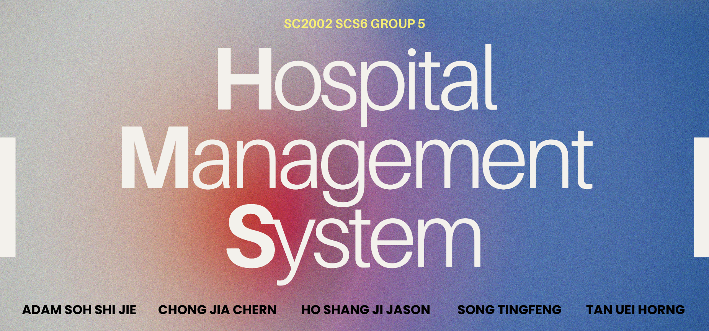

# Hospital Management System (HMS)

**NTU College of Computing and Data Science**

## SC2002 Assignment | SCS6 GROUP 5

<p align="center">
  
</p>


## Table of Contents

1. [Team Members](#team-members)
2. [Project Overview](#project-overview)
3. [Features](#features)
    - [Patient](#patient)
    - [Doctor](#doctor)
    - [Pharmacist](#pharmacist)
    - [Administrator](#administrator)
4. [Assumptions](#assumptions)
5. [Additional Features](#additional-features)
6. [Installation](#installation)
7. [Running the Application](#running-the-application)
    - [Using Command Line](#using-command-line)
    - [Using Scripts](#using-scripts)
    - [Using IntelliJ IDEA](#using-intellij-idea)
8. [UML Class Diagram](#uml-class-diagram)
9. [License](#license)
10. [Contact](#contact)
11. [Disclaimer](#disclaimer)

---
## Team Members

We are **Group 5** from lab group **SCS6**, CCDS, Nanyang Technological University, Singapore. Our team consists of 5 members:

| Name               | GitHub Account | Email                |
|--------------------|----------------|----------------------|
| Adam Soh Shi Jie   | adamsohjunior  | adam0025@e.ntu.edu.sg|
| Chong Jia Chern    | goldenchern    | jchong069@e.ntu.edu.sg|
| Ho Shang Ji Jason  | ho-shang-jj    | hosh0029@e.ntu.edu.sg|
| Song Tingfeng      | tingfeng03     | tsong005@e.ntu.edu.sg|
| Tan Uei Horng      | tanueihorng    | utan001@e.ntu.edu.sg |

---
## Project Overview
Hospital Management System (HMS) is a Java-based console application developed for the SC2002 course assignment. HMS streamlines hospital operations by managing appointment scheduling, inventory, and staff administration. It supports patients, doctors, pharmacists, and administrators, ensuring adaptability and scalability. HMS aims to improve resource utilization, enhance patient care, and simplify administrative tasks through an efficient command-line interface.

---

## Features

### Patient
- ✅ Profile Management
- ✅ Secure Authentication
- ✅ Appointment Handling
- ✅ Medical Records
- ✅ Inbox
- ✅ Feedback

### Doctor
- ✅ Profile Management
- ✅ Secure Authentication
- ✅ Availability Management
- ✅ Appointment Management
- ✅ Medical Documentation
- ✅ Medication Prescription
- ✅ Inbox
- ✅ Performance Review

### Pharmacist
- ✅ Profile Management
- ✅ Secure Authentication
- ✅ Medication Management
- ✅ Replenishment Requests
- ✅ Inbox

### Administrator
- ✅ Profile Management
- ✅ Secure Authentication
- ✅ User Management
- ✅ Inventory Control
- ✅ Replenishment Approval
- ✅ Reporting
- ✅ Inbox
- ✅ Performance Review

### Assumptions

| Assumption            | Description                                                                 |
|-----------------------|-----------------------------------------------------------------------------|
| Doctor Availability   | Doctors must manually input their availability for patient appointments.    |
| 24/7 Service          | HMS provides continuous service for all users.                              |
| Medicine Quantity     | Inventory tracks medicine in packets, not individual pills.                 |
| Date & Time           | The system uses the current date as a reference for scheduling.             |


---

### Additional Features

1. **Password Validation**: Ensures strong passwords with specific requirements.
2. **Datetime Validation**: Verifies valid datetime format and existence.
3. **Inbox**: User inbox for messages and automatic notifications.
4. **Rating**: Patients rate doctors, and admins view ratings.
5. **UI Enhancement**: Pretty printing, user menus, and ASCII art title.
6. **Password Invisibility**: Hides password input for enhanced privacy and security.

---

## Installation

1. **Clone the Repository:**
   ```bash
   git clone https://github.com/tanueihorng/sc2002-hms.git
   ```
2. **Navigate to the Project Directory:**
   ```bash
   cd Hospital-Management-System
   ```
3. **Build & Run the Project:**
   - Open the project in [JetBrains IntelliJ IDEA](https://www.jetbrains.com/idea/).
   - Ensure you have Java 17 installed.
   - Build the project using IntelliJ IDEA's build tools.

---

## Running the Application

### **Using Command Line:**

1. **Navigate to the Build Directory:**
   ```bash
   cd out/artifacts/HMS_jar/
   ```
2. **Run the Jar File:**
   ```bash
   java -jar HMS.jar
   ```

### **Using Scripts:**

- **For Unix/Linux:**
  ```bash
  ./run.sh
  ```
- **For Windows:**
  ```cmd
  run.cmd
  ```

### **Using IntelliJ IDEA:**

- Open the project in IntelliJ IDEA.
- Locate the `HMS.java` file in `src/system/`.
- Run the `HMS` class.

**Initial Login Credentials:**
- **Default Password for All Users:** `password`

---

## UML Class Diagram

The UML class diagram for HMS is done using plantuml code and can be viewed [here](diagram\hms_classdiagram.svg).

---

## License

MIT © Adam Soh Shi Jie, Chong Jia Chern, Ho Shang Ji Jason, Song Tingfeng, Tan Uei Horng

---

## Contact

For any queries or support, please contact any of the team members via their provided email addresses.

---

## Disclaimer

This project is developed for educational purposes as part of the SC2002 course assignment at Nanyang Technological University, Singapore. 
[16 November 2024]
 
